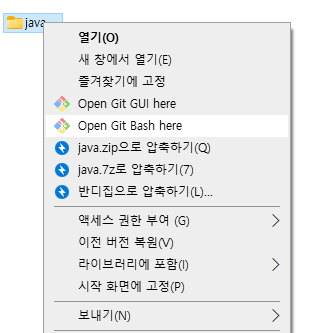
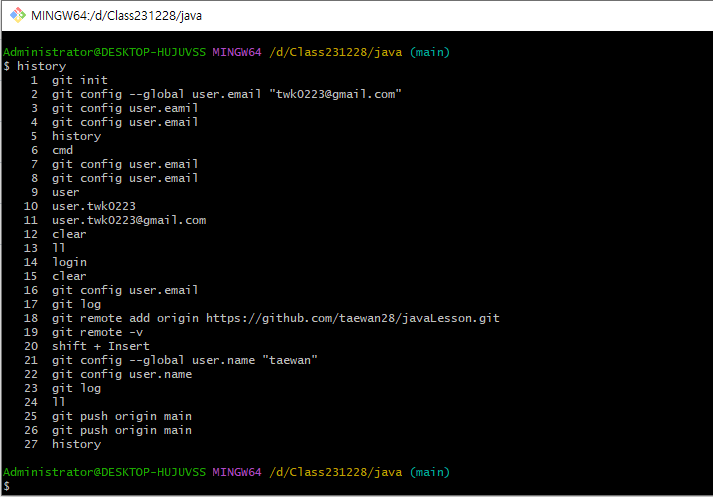

## git 버전 관리

### git 설치 
 * [git-scm 다운로드](https://git-scm.com/)

### github 원격 저장소 사용하기
 * [github 계정만들기](https://github.com/)

### 로컬 저장소 초기화
 * git 명령어 실행하기
  
  
     $ git init

 * git 사용자 이메일 설정

     $ git config --global user.email "자신의 이메일"
     $ git config --globla user.name "자신의 이름"
 * git 사용자 이메일 확인

     $ git config user.email

### 원격저장소 등록

 * 원격저장소 만들기

     $ git remot add origin (github의 저장소 주소)

 * 원격저장소 확인
     $ git remote -v

### commit

 * 커밋은 파일의 변경점을 관리하기 위한 기록입니다.
 * 우리는 편의상 git 명령어 대신에 vs code 설정파일은 제외시키는 '.gitignore' 파일을 추가합니다.
     - 위 아이콘 메뉴를 클릭하면 commit 대상이 되는 파일들이 changes 항목 아래에 보입니다.
     - 그 파일들 중에서 커밋을 원하는 파일들을 선택해서 + 아이콘을 클립합니다.
     - 위에서 선택한 파일들은 커밋 대상이 되고 Staged Changes 항목아래에 보입니다.
     - 맨 위 입력란에 커밋 메시지를 작성하고 commit 버튼을 클릭합니다.
 * 커밋 기록을 확인하는 명령어
     $ git log

### push

 * 커밋된 파일들을 원격저장소로 보내 저장합니다

     $ git puch origin main

     - 로컬저장소 main 의 커밋된 파일을 원격저장소 origin으로 puch 하는 명령
     - push 를 처음 할 떄에는 guthub의 인증 과정을 위해 브라우저에 인증절차 화면이 자동으로 뜹니다. 버튼 클릭!!

 * 저장소를 새로 고침하면 커밋한 파일들의 목록을 볼수 있습니다.

 [참고] 로컬저장소는 .git 폴더 삭제하고 원격저장소는 리포지토리만 삭제하면 완전 처음부터 다시할 수 있습니다.

    ### 순서
    1) git init
    2) git remote add origin
    3) git config --global user.email
    4) git config --global user.name

    반복되는 작업은
    1) vs code : Staged Changes 로 커밋할 파일 선택하기
    2) vs code : commit 하기. 메시지 꼭 작성하기
    3) vs code : 메뉴에서 push . github으로 소스 전송 확인하세요.

    집에 가서 한번만 할것
    1) git clone 원격주소
    2) git config --global user.email
    3) git config --global user.name
    4) clone으로 생긴 프로젝트를 vs code에서 열기

    집에가서 반복할 작업은
    1) vs code : 메뉴에서 pull. github에 있는 소스를 받아오기.
    (동기화)
    2) 새로 작성한 연습 코드 소스 파일은 stage - commit - push 